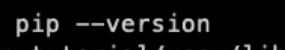

<!-- # Welcome to MkDocs

For full documentation visit [mkdocs.org](https://www.mkdocs.org).

## Commands

* `mkdocs new [dir-name]` - Create a new project.
* `mkdocs serve` - Start the live-reloading docs server.
* `mkdocs build` - Build the documentation site.
* `mkdocs -h` - Print help message and exit.

## Project layout

    mkdocs.yml    # The configuration file.
    docs/
        index.md  # The documentation homepage.
        ...       # Other markdown pages, images and other files. -->


# 这是利用Typora写的第（我也忘了）份Md

我的搜索界面是一只皮卡丘。


git推送的命令

后续上传文件不想打开vs，或没必要做出调整时，可直接梭哈

```shell
git add .

git commit -m "your commit message"

git push origin main
```

# 创建python虚拟环境

```
python -m venv myvenv
```

激活虚拟环境


查看版本



激活，进入虚拟环境

```shell
myvenv\Scripts\activate
```

主要是根据venv所在的目录


退出虚拟环境

```
deactivate
```

